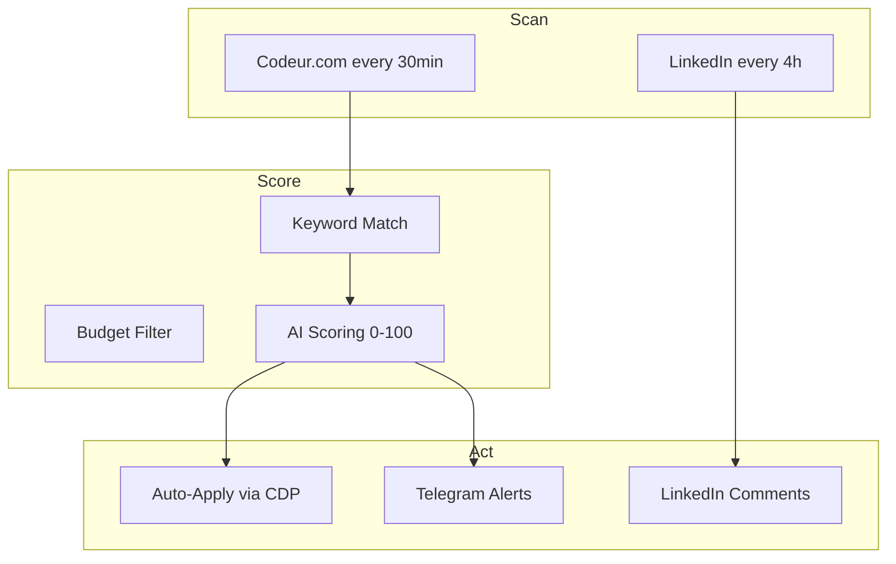

# 🤖 AI Freelance Automation

**Automated freelance prospection — Scan, score, apply, engage. All AI-powered.**

## How It Works

## Results (March 2026)

| Metric | Value |
|--------|-------|
| Offers posted | 6 |
| Total value | 9,900 EUR |
| LinkedIn actions | 5 |
| Workflow runs | 9+ |

## Scripts

| Script | Purpose |
|--------|---------|
| `codeur-veille.py` | Scan & score projects |
| `publish.py` | Post to LinkedIn/GitHub |
| `cdp.py` | 33-function CDP wrapper |
| `comet_cluster.py` | Distributed AI engine |
| `db_sync.py` | SQLite persistence |

## Author

**Franck Delmas** — [GitHub](https://github.com/Turbo31150) · [Portfolio](https://turbo31150.github.io/franckdelmas.dev/)
