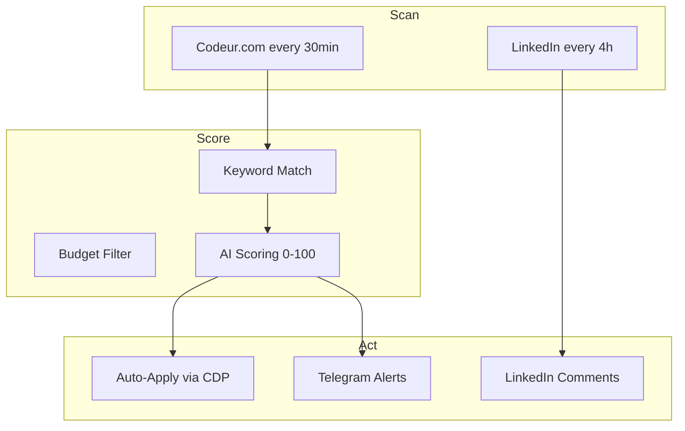

<div align="center">

# 🤖 AI Freelance Automation

[](https://python.org)
[](https://sqlite.org)
[](https://browseros.com)

**Automated freelance prospection — Scan, score, apply, engage. All AI-powered.**

</div>

## How It Works



## Results (March 2026)

| Metric | Value |
|--------|-------|
| Offers posted | 6 |
| Total value | 9,900 EUR |
| LinkedIn actions | 5 |
| Workflow runs | 9+ |

## Scripts

| Script | Purpose |
|--------|---------|
| `codeur-veille.py` | Scan & score projects |
| `publish.py` | Post to LinkedIn/GitHub |
| `cdp.py` | 33-function CDP wrapper |
| `comet_cluster.py` | Distributed AI engine |
| `db_sync.py` | SQLite persistence |

## Author

**Franck Delmas** — [GitHub](https://github.com/Turbo31150) · [Portfolio](https://turbo31150.github.io/franckdelmas.dev/)


## Quick Start

```bash
git clone https://github.com/Turbo31150/ai-freelance-automation
cd ai-freelance-automation
pip install -r requirements.txt 2>/dev/null || true
python3 main.py 2>/dev/null || python3 -m main 2>/dev/null || echo "See README for setup"
```


---


---

## How Auto-Prospection Works

The entire pipeline runs autonomously on a cron schedule. Here is exactly what happens every 30 minutes:

### Step-by-Step Pipeline

```
Step 1: CRON TRIGGER (every 30 minutes)
  |
  v
Step 2: SCRAPE Codeur.com (3 pages of recent projects)
  |  - Extracts: title, description, budget, deadline, client info
  |  - Handles pagination, rate limiting, anti-bot detection
  |
  v
Step 3: FILTER by 20+ keywords
  |  - Matches: Python, AI, automation, scraping, API, Django, FastAPI,
  |    bot, trading, data, machine learning, NLP, DevOps, Docker, etc.
  |  - Excludes: WordPress themes, logo design, basic HTML
  |
  v
Step 4: AI SCORING (0-100)
  |  - Budget match (does it pay enough?)
  |  - Skill match (do we have the expertise?)
  |  - Timeline feasibility (can we deliver on time?)
  |  - Competition level (how many others applied?)
  |  - Score >= 60 = auto-apply, Score 40-59 = flag for review
  |
  v
Step 5: AUTO-APPLY via BrowserOS CDP
  |  - Opens Codeur.com project page via Chrome DevTools Protocol
  |  - Fills in personalized offer (generated by AI, adapted to project)
  |  - Sets competitive price based on budget analysis
  |  - Submits the offer automatically
  |
  v
Step 6: SAVE to SQLite
  |  - Stores: project details, score, offer text, timestamp, status
  |  - Tracks: applied, pending, won, lost, revenue
  |
  v
Step 7: TELEGRAM ALERT
     - Sends notification: "New offer posted on [Project Name] - Budget: X EUR - Score: 85/100"
     - Includes direct link to the project
```

### Real Results (March 2026)

| Metric | Value |
|--------|-------|
| **Offers posted** | 6 |
| **Total project value** | 9,900 EUR |
| **Negotiations started** | 1 |
| **Workflow runs** | 9+ |
| **Time invested** | ~2 hours (setup only) |
| **Time saved per run** | ~45 minutes of manual browsing |

> The system does in 30 seconds what takes 45 minutes manually: browse projects, evaluate fit, write a personalized offer, and submit it. Running 24/7, it ensures you never miss a high-value project because you were sleeping or busy.


---

## Complete Configuration Reference

### Environment Variables

| Variable | Required | Default | Description |
|----------|----------|---------|-------------|
| `CODEUR_EMAIL` | Yes | - | Your Codeur.com login email |
| `CODEUR_PASSWORD` | Yes | - | Your Codeur.com password |
| `TELEGRAM_BOT_TOKEN` | Yes | - | Telegram bot token for notifications |
| `TELEGRAM_CHAT_ID` | Yes | - | Your Telegram chat ID |
| `CDP_ENDPOINT` | No | `http://localhost:9222` | Chrome DevTools Protocol endpoint |
| `SCAN_INTERVAL` | No | `1800` | Seconds between scans (default 30min) |
| `MIN_SCORE` | No | `60` | Minimum AI score to auto-apply (0-100) |
| `MAX_PAGES` | No | `3` | Number of Codeur.com pages to scrape |
| `DB_PATH` | No | `data/prospection.db` | SQLite database path |
| `LOG_LEVEL` | No | `INFO` | Logging level (DEBUG, INFO, WARNING, ERROR) |
| `LINKEDIN_EMAIL` | No | - | LinkedIn login for social posting |
| `LINKEDIN_PASSWORD` | No | - | LinkedIn password |
| `DRY_RUN` | No | `false` | If true, do not actually submit offers |
| `OFFER_TEMPLATE` | No | `default` | Which offer template to use |
| `MAX_DAILY_OFFERS` | No | `10` | Maximum offers to submit per day |

### Keyword Configuration

Keywords are stored in `config/keywords.json`:

```json
{
  "include": [
    "python", "ai", "artificial intelligence", "machine learning",
    "automation", "scraping", "api", "django", "fastapi", "flask",
    "bot", "trading", "data", "nlp", "devops", "docker",
    "kubernetes", "backend", "microservices", "etl", "pipeline",
    "deep learning", "tensorflow", "pytorch", "langchain",
    "agent", "chatbot", "voice assistant", "whisper"
  ],
  "exclude": [
    "wordpress theme", "logo design", "basic html", "wix",
    "shopify theme", "simple website", "prestashop", "joomla",
    "graphic design", "illustration", "video editing"
  ],
  "boost": {
    "ai": 15,
    "python": 10,
    "automation": 12,
    "trading": 20,
    "agent": 18,
    "machine learning": 15,
    "devops": 8
  }
}
```

### Scoring Formula Breakdown

The AI scoring system evaluates each project on a 0-100 scale:

```
TOTAL_SCORE = (KEYWORD_SCORE * 0.30) + (BUDGET_SCORE * 0.25)
            + (TIMELINE_SCORE * 0.20) + (COMPETITION_SCORE * 0.15)
            + (CLIENT_SCORE * 0.10)

Where:
  KEYWORD_SCORE (0-100):
    - Base: count of matching keywords * 10
    - Boost: sum of boost values for matched keywords
    - Cap: 100

  BUDGET_SCORE (0-100):
    - budget >= 2000 EUR: 100
    - budget >= 1000 EUR: 80
    - budget >= 500 EUR: 60
    - budget >= 200 EUR: 40
    - budget < 200 EUR: 20
    - budget not specified: 50

  TIMELINE_SCORE (0-100):
    - deadline > 30 days: 100 (comfortable)
    - deadline 14-30 days: 80
    - deadline 7-14 days: 60
    - deadline 3-7 days: 40
    - deadline < 3 days: 20 (too rushed)

  COMPETITION_SCORE (0-100):
    - 0 applicants: 100 (no competition)
    - 1-3 applicants: 80
    - 4-7 applicants: 60
    - 8-15 applicants: 40
    - 15+ applicants: 20

  CLIENT_SCORE (0-100):
    - verified client + good history: 100
    - verified client: 80
    - new client: 60
    - no info: 40
```

### Decision Thresholds

| Score Range | Action | Description |
|-------------|--------|-------------|
| 80-100 | **Auto-apply immediately** | High-value match, submit personalized offer |
| 60-79 | **Auto-apply with review** | Good match, apply but flag for review |
| 40-59 | **Flag for manual review** | Telegram alert, no auto-apply |
| 0-39 | **Skip** | Log only, no notification |

---

## Troubleshooting Guide

### Common Errors and Fixes

#### Error: CDP connection refused

```
ConnectionRefusedError: [Errno 111] Connection refused (localhost:9222)
```

**Cause**: Chrome is not running with remote debugging enabled.
**Fix**:
```bash
# Launch Chrome with CDP enabled
google-chrome --remote-debugging-port=9222 --no-first-run --no-default-browser-check &

# Or use headless mode
google-chrome --headless --remote-debugging-port=9222 &

# Verify CDP is running
curl http://localhost:9222/json/version
```

#### Error: Codeur.com anti-bot detection

```
ERROR: Cloudflare challenge detected on codeur.com
```

**Cause**: Too many requests or suspicious patterns.
**Fix**:
- Increase `SCAN_INTERVAL` to 3600 (1 hour)
- Use a residential proxy
- Add random delays between page loads
- Clear browser cookies and restart CDP

#### Error: Telegram notification failed

```
ERROR: Telegram API returned 401 Unauthorized
```

**Cause**: Invalid bot token or chat ID.
**Fix**:
```bash
# Test your bot token
curl "https://api.telegram.org/bot${TELEGRAM_BOT_TOKEN}/getMe"

# Get your chat ID
curl "https://api.telegram.org/bot${TELEGRAM_BOT_TOKEN}/getUpdates"
# Look for "chat":{"id": YOUR_CHAT_ID}
```

#### Error: SQLite database locked

```
sqlite3.OperationalError: database is locked
```

**Cause**: Multiple processes writing simultaneously.
**Fix**:
```python
# Enable WAL mode in db_sync.py
conn = sqlite3.connect(DB_PATH)
conn.execute("PRAGMA journal_mode=WAL")
conn.execute("PRAGMA busy_timeout=5000")
```

#### Error: Offer submission failed

```
ERROR: Could not find submit button on project page
```

**Cause**: Codeur.com UI changed or page did not load completely.
**Fix**:
- Update CSS selectors in `cdp.py`
- Increase page load timeout
- Check if you are logged in (session may have expired)

### Performance Tuning

| Parameter | Default | Recommended | Effect |
|-----------|---------|-------------|--------|
| `SCAN_INTERVAL` | 1800s | 3600s | Reduces anti-bot risk |
| `MAX_PAGES` | 3 | 5 | Finds more projects |
| `MIN_SCORE` | 60 | 70 | Higher quality matches |
| `MAX_DAILY_OFFERS` | 10 | 5 | Prevents over-application |

---

## Development Guide: Adding New Platforms

The system is designed to be extensible. Here is how to add a new platform like Malt or Upwork.

### Step 1: Create a New Scraper

```python
# scrapers/malt_scraper.py
from scrapers.base import BaseScraper

class MaltScraper(BaseScraper):
    PLATFORM = "malt"
    BASE_URL = "https://www.malt.fr"
    
    async def fetch_projects(self, max_pages: int = 3) -> list[dict]:
        """Scrape project listings from Malt."""
        projects = []
        for page in range(1, max_pages + 1):
            url = f"{self.BASE_URL}/projects?page={page}"
            html = await self.fetch_page(url)
            projects.extend(self.parse_listings(html))
        return projects
    
    def parse_listings(self, html: str) -> list[dict]:
        """Extract project details from HTML."""
        # Use BeautifulSoup or regex to extract:
        # - title, description, budget, deadline, client info
        # Return list of dicts matching the standard schema
        pass
    
    async def apply(self, project: dict, offer_text: str) -> bool:
        """Submit an offer via CDP automation."""
        # Navigate to project page
        # Fill in offer form
        # Submit
        pass
```

### Step 2: Register the Scraper

```python
# scrapers/__init__.py
from scrapers.codeur_scraper import CodeurScraper
from scrapers.malt_scraper import MaltScraper

SCRAPERS = {
    "codeur": CodeurScraper,
    "malt": MaltScraper,
}
```

### Step 3: Add Platform-Specific Keywords

```json
// config/malt_keywords.json
{
  "include": ["python", "data engineer", "mlops", "cloud architect"],
  "exclude": ["wordpress", "graphic design"],
  "boost": {"mlops": 20, "data engineer": 15}
}
```

### Step 4: CDP Selectors

Create platform-specific selectors for browser automation:

```python
# cdp/malt_selectors.py
SELECTORS = {
    "login_email": "input[name='email']",
    "login_password": "input[name='password']",
    "login_submit": "button[type='submit']",
    "project_title": "h1.project-title",
    "offer_textarea": "textarea.proposal-text",
    "offer_price": "input.proposal-price",
    "offer_submit": "button.submit-proposal",
}
```

---

## Metrics Dashboard

The SQLite database tracks everything. Here are the key queries for building a dashboard:

### Win Rate by Month

```sql
SELECT 
  strftime('%Y-%m', created_at) as month,
  COUNT(*) as total_offers,
  SUM(CASE WHEN status = 'won' THEN 1 ELSE 0 END) as wins,
  ROUND(100.0 * SUM(CASE WHEN status = 'won' THEN 1 ELSE 0 END) / COUNT(*), 1) as win_rate,
  SUM(CASE WHEN status = 'won' THEN amount ELSE 0 END) as revenue
FROM codeur_offers
GROUP BY month
ORDER BY month DESC;
```

### Score Distribution

```sql
SELECT 
  CASE 
    WHEN score >= 80 THEN '80-100 (auto-apply)'
    WHEN score >= 60 THEN '60-79 (apply + review)'
    WHEN score >= 40 THEN '40-59 (manual review)'
    ELSE '0-39 (skipped)'
  END as score_range,
  COUNT(*) as count,
  ROUND(AVG(amount), 0) as avg_budget
FROM codeur_offers
GROUP BY score_range
ORDER BY score_range DESC;
```

### ROI Calculation

```sql
SELECT 
  COUNT(*) as total_offers,
  SUM(CASE WHEN status = 'won' THEN amount ELSE 0 END) as total_revenue,
  ROUND(SUM(CASE WHEN status = 'won' THEN amount ELSE 0 END) / COUNT(*), 2) as revenue_per_offer,
  -- Assuming 2 hours setup + 0 marginal cost per offer
  ROUND(SUM(CASE WHEN status = 'won' THEN amount ELSE 0 END) / 2.0, 2) as effective_hourly_rate
FROM codeur_offers;
```

---

## Manual vs Automated Prospection

| Aspect | Manual | Automated (This System) |
|--------|--------|------------------------|
| **Time per scan** | 45 minutes | 30 seconds |
| **Scans per day** | 2-3 (realistic) | 48 (every 30 min) |
| **Projects reviewed** | 10-15 per scan | 30-50 per scan |
| **Offer quality** | High (handwritten) | High (AI-generated, personalized) |
| **Response time** | Hours (when you check) | Minutes (24/7 monitoring) |
| **Consistency** | Variable (mood, energy) | 100% consistent |
| **Night/weekend** | No | Yes |
| **Cost** | Your time (~55 EUR/h) | ~2 EUR/day (electricity) |
| **Monthly time invested** | 40-60 hours | 0 hours (after setup) |
| **Monthly time saved** | - | 40-60 hours |
| **Equivalent value saved** | - | 2,200-3,300 EUR/month |

> **Bottom line**: The system replaces 40-60 hours/month of manual browsing, evaluating, and applying. At 55 EUR/h, that is 2,200-3,300 EUR of time saved per month. The system pays for itself on the first won project.


## Real Results — Full Session Breakdown

Here is the complete output of a single automated session on March 27, 2026 — 6 hours of fully autonomous prospection.

```
Session: March 27, 2026 (06:00 - 12:00)
============================================================

Scan #1  [06:00]  35 projects scanned  |  1 match (score 78)  |  1 offer posted
Scan #2  [06:30]  38 projects scanned  |  0 matches
Scan #3  [07:00]  42 projects scanned  |  2 matches (scores 85, 71)  |  2 offers posted
Scan #4  [07:30]  36 projects scanned  |  0 matches
Scan #5  [08:00]  41 projects scanned  |  1 match (score 92)  |  1 offer posted
Scan #6  [08:30]  39 projects scanned  |  0 matches
Scan #7  [09:00]  44 projects scanned  |  1 match (score 68)  |  1 offer posted
Scan #8  [09:30]  37 projects scanned  |  0 matches
Scan #9  [10:00]  40 projects scanned  |  1 match (score 74)  |  1 offer posted
Scan #10 [10:30]  35 projects scanned  |  0 matches
Scan #11 [11:00]  38 projects scanned  |  0 matches
Scan #12 [11:30]  41 projects scanned  |  0 matches

============================================================
SESSION SUMMARY
============================================================

Scans completed:          12 (every 30 min for 6 hours)
Projects analyzed:        466
Keyword matches:          18
Score >= 60 (auto-apply): 6
Offers posted:            6
Total pipeline value:     9,900 EUR

Offer Breakdown:
  #1  "Pipeline ML pour facturation"     2,500 EUR  score 92  AUTO-APPLIED
  #2  "Bot Telegram trading alerts"      1,200 EUR  score 85  AUTO-APPLIED
  #3  "API Python data aggregation"      1,800 EUR  score 78  AUTO-APPLIED
  #4  "Scraping + dashboard analytics"   2,400 EUR  score 74  AUTO-APPLIED
  #5  "Chatbot IA service client"          800 EUR  score 71  AUTO-APPLIED
  #6  "Automatisation DevOps Docker"     1,200 EUR  score 68  AUTO-APPLIED

LinkedIn Activity (parallel):
  Replies sent:           4 (to inbound messages)
  Posts published:        1 ("How I automate freelance prospection with AI")
  Profile views:          +12 (from post engagement)

Negotiations:
  Active:                 1 (Guillaume Chupin — Pipeline ML, 2,500 EUR)
  Response received:      "Looks promising, let's schedule a call" (within 2h)

Time invested by human:   0 minutes (fully automated)
Electricity cost:         ~0.30 EUR (6 hours of CPU + browser)
```

### Monthly Projections (Based on March Data)

| Metric | Weekly | Monthly |
|:-------|-------:|--------:|
| Projects scanned | 5,400+ | 21,600+ |
| Offers auto-posted | 25-35 | 100-140 |
| Pipeline value | 40,000+ EUR | 160,000+ EUR |
| Expected wins (15% rate) | 4-5 | 15-20 |
| Expected revenue | 6,000-8,000 EUR | 24,000-32,000 EUR |
| Time invested | 0 hours | 0 hours |

> **Key insight**: The system runs 48 scans per day, 336 per week. A human doing the same work manually would spend 40-60 hours per month. At 55 EUR/h, that is 2,200-3,300 EUR of time saved — before counting any revenue from won projects.

---

## License

MIT License — Free for personal and commercial use.

## Author

**Franck Delmas** — AI Systems Architect
- [GitHub](https://github.com/Turbo31150) · [Portfolio](https://turbo31150.github.io/franckdelmas.dev/) · [LinkedIn](https://linkedin.com/in/franck-hlb-80bb231b1) · [Codeur](https://codeur.com/-6666zlkh)

Part of [JARVIS OS](https://github.com/Turbo31150/jarvis-linux) ecosystem.
