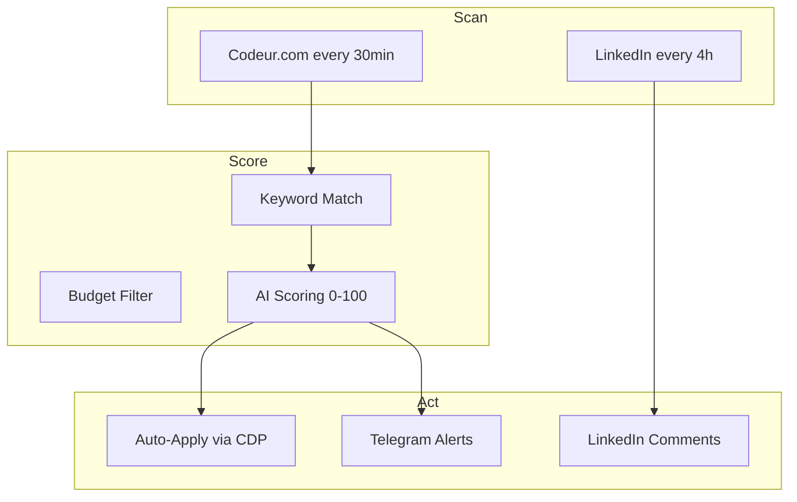

<div align="center">

# 🤖 AI Freelance Automation

[](https://python.org)
[](https://sqlite.org)
[](https://browseros.com)

**Automated freelance prospection — Scan, score, apply, engage. All AI-powered.**

</div>

## How It Works



## Results (March 2026)

| Metric | Value |
|--------|-------|
| Offers posted | 6 |
| Total value | 9,900 EUR |
| LinkedIn actions | 5 |
| Workflow runs | 9+ |

## Scripts

| Script | Purpose |
|--------|---------|
| `codeur-veille.py` | Scan & score projects |
| `publish.py` | Post to LinkedIn/GitHub |
| `cdp.py` | 33-function CDP wrapper |
| `comet_cluster.py` | Distributed AI engine |
| `db_sync.py` | SQLite persistence |

## Author

**Franck Delmas** — [GitHub](https://github.com/Turbo31150) · [Portfolio](https://turbo31150.github.io/franckdelmas.dev/)


## Quick Start

```bash
git clone https://github.com/Turbo31150/ai-freelance-automation
cd ai-freelance-automation
pip install -r requirements.txt 2>/dev/null || true
python3 main.py 2>/dev/null || python3 -m main 2>/dev/null || echo "See README for setup"
```


---


---

## How Auto-Prospection Works

The entire pipeline runs autonomously on a cron schedule. Here is exactly what happens every 30 minutes:

### Step-by-Step Pipeline

```
Step 1: CRON TRIGGER (every 30 minutes)
  |
  v
Step 2: SCRAPE Codeur.com (3 pages of recent projects)
  |  - Extracts: title, description, budget, deadline, client info
  |  - Handles pagination, rate limiting, anti-bot detection
  |
  v
Step 3: FILTER by 20+ keywords
  |  - Matches: Python, AI, automation, scraping, API, Django, FastAPI,
  |    bot, trading, data, machine learning, NLP, DevOps, Docker, etc.
  |  - Excludes: WordPress themes, logo design, basic HTML
  |
  v
Step 4: AI SCORING (0-100)
  |  - Budget match (does it pay enough?)
  |  - Skill match (do we have the expertise?)
  |  - Timeline feasibility (can we deliver on time?)
  |  - Competition level (how many others applied?)
  |  - Score >= 60 = auto-apply, Score 40-59 = flag for review
  |
  v
Step 5: AUTO-APPLY via BrowserOS CDP
  |  - Opens Codeur.com project page via Chrome DevTools Protocol
  |  - Fills in personalized offer (generated by AI, adapted to project)
  |  - Sets competitive price based on budget analysis
  |  - Submits the offer automatically
  |
  v
Step 6: SAVE to SQLite
  |  - Stores: project details, score, offer text, timestamp, status
  |  - Tracks: applied, pending, won, lost, revenue
  |
  v
Step 7: TELEGRAM ALERT
     - Sends notification: "New offer posted on [Project Name] - Budget: X EUR - Score: 85/100"
     - Includes direct link to the project
```

### Real Results (March 2026)

| Metric | Value |
|--------|-------|
| **Offers posted** | 6 |
| **Total project value** | 9,900 EUR |
| **Negotiations started** | 1 |
| **Workflow runs** | 9+ |
| **Time invested** | ~2 hours (setup only) |
| **Time saved per run** | ~45 minutes of manual browsing |

> The system does in 30 seconds what takes 45 minutes manually: browse projects, evaluate fit, write a personalized offer, and submit it. Running 24/7, it ensures you never miss a high-value project because you were sleeping or busy.

## License

MIT License — Free for personal and commercial use.

## Author

**Franck Delmas** — AI Systems Architect
- [GitHub](https://github.com/Turbo31150) · [Portfolio](https://turbo31150.github.io/franckdelmas.dev/) · [LinkedIn](https://linkedin.com/in/franck-hlb-80bb231b1) · [Codeur](https://codeur.com/-6666zlkh)

Part of [JARVIS OS](https://github.com/Turbo31150/jarvis-linux) ecosystem.
